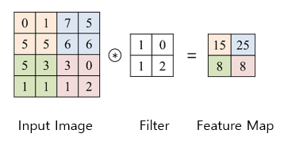
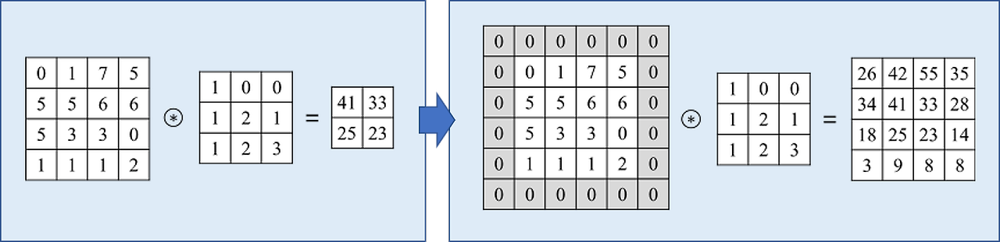
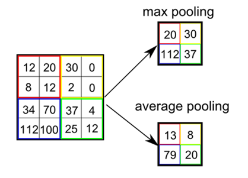

# CNN (Convolution Neural Network)

## CNN이 왜 필요한가?
처음에는 전통적인 인공 신경망인 MLP(다중 퍼셉트론)로 이미지를 학습시키려고 하였는데요.
MLP에서 학습 하기 위해서는 모든 뉴런이 서로 연결된 형태로 이미지 학습을 진행해야 했기 때문에 이미지를 1차원 벡터로 펼쳐서 진행해야 했습니다.
여기서 문제가 발생하게 됩니다. 256*256 크기의 이미지를 1차원으로 펼치게 되면 196,608개의 입력이 만들어집니다.
펼쳐진 입력에서 문제가 발생하는데 공간적인 정보인 픽셀들 사이의 관계가 많이 사라지게 된다는 점입니다.
즉, MLP로 학습을 하게 되면 이미지를 효율적으로 학습하지 못하고 비효율적이게 됩니다.

여기서 등장한게 **CNN**입니다.
CNN은 이미지를 학습하는데 특화된 구조를 지니고 있습니다.
MLP 한계를 극복할 수 있는 방법으로 CNN에 이미지가 입력되게 되면 2차원 구조를 유지하면서 학습이 가능하게 됩니다.
즉, 이미지의 공간적 패턴을 유지하고 픽셀간의 사이인 지역적 특징을 유지하면서 학습이 가능하게 됩니다.

## CNN의 구성 요소는 어떻게 되는가?
CNN에 대해 알아봤으니 CNN이 어떻게 구성되어 있는지 알아야겠죠?
우선 CNN의 주요 구성 요소는 크게 세 가지로 **컨볼루션층**, **풀링층**, **완전연결층**으로 나눠지게 됩니다.
이 세 가지의 요소가 각각 어떤 역할을 하는지 알아보겠습니다.

**1. 컨볼루션층(Convolution Layer)**
컨볼루션층은 CNN의 첫 번째 핵심 요소로 컨볼루션층에서는 특징을 추출하는 역할을 하고 있습니다.
사람이 큰 이미지를 보고 있을 때 한꺼번에 모든 이미지를 보는 것이 아니라, 특징을 보면서 이게 어떤 이미지인지 파악하게 됩니다.
이 방법을 활용해서 이미지의 특징인 가장자리, 모서리 등의 영역을 추출하는 단계라고 생각하시면 쉽습니다.

그렇다면 어떻게 이미지 특징을 추출할까요?
바로 **필터(커널)**를 사용하게 됩니다. 필터는 다양하게 존재하는데, 각 특징을 추출하는 필터가 여러 개 존재하게 됩니다.
입력된 하나의 이미지가 있고 필터를 적용하게 된다면 이미지의 작은 영역을 훑고 다니면서 각 부분에서 특징을 추출하게 됩니다.
아래 이미지처럼 색깔별로 필터와 이미지 합성곱을 진행하면서 특징맵을 추출하게 됩니다.

출처 : https://jarikki.tistory.com/26

여기서는 이미지를 2칸씩 이동했는데 이렇게 이동하는 단위를 **stride**라고 합니다.
그렇다면 위에 이미지에서는 stride는 2가 되겠죠? 자, 여기까지 이해되었으면 좋겠습니다.

그런데 여기서도 문제가 발생하게 됩니다. CNN은 컨볼루션층을 여러 번 거치다보니 필터로 인해서 특징맵의 크기가 이미지에 비해 줄어들게 됩니다.
이를 방지하기 위해서 padding이라는 기법을 사용하게 됩니다.
아래 이미지의 회색 영역처럼 padding은 입력 이미지 가장자리에 0을 추가하면서 필터를 적용하더라도 특징맵의 크기가 줄어들지 않게 합니다.
이로 인해서 가장자리 정보를 보존할 수 있다는 점과 정보 손실을 최소화할 수 있다는 장점이 있습니다.

출처 : https://jarikki.tistory.com/26

이런 식으로 이미지를 훑고 지나가게 되면 이미지의 공간적 구조를 보존하게 되면서 이미지의 중요한 부분을 학습할 수 있게 됩니다.
이 때 필터는 **가중치 공유**라는 개념을 사용하는데 같은 필터가 모든 부분에서 동일하게 사용된다는 의미입니다.
이로 인해 매개변수의 수를 줄여서 학습이 효율적으로 이루어지게 됩니다.

**2. 풀링층(Pooling Layer)**
컨볼루션층으로 인해 각 특징맵을 추출하게 되었습니다. 
그렇다면 이제 이 추출한 특징맵에서 중요한 부분을 다시 골라내보겠습니다.
우리 일상 생활에서 예시를 들자면 컨볼루션층에서는 공부한 내용 중 중요한 내용을 을 밑줄을 치는 과정이라면 풀링층은 밑줄 친 내용을 간단하게 요약하여 필기하는 작업이라고 생각하시면 좋습니다.(적절한 예시인지 의문이네요)
자, 다시 간단히 설명하면 컨볼루션층에서 나온 여러 특징 맵을 간단하게 요약하는 과정이라고 생각하시면 좋습니다.
아무래도 간단하게 요약하는 작업이다보니 풀링층을 진행하게 되면 특징 맵의 크기가 줄어들게 됩니다. 또한 중요한 정보를 유지하면서 덜 중요한 세부 사항을 무시하게 되는 것이죠.
우리가 필기를 하게 되면 완벽하게 중요한 내용을 캐치 못하는 것과 동일한 방식이라고 생각해두시면 좋습니다.

이런 식으로 풀링을 진행하면서 얻는 첫번째 장점은 **CNN의 계산량이 줄어들게 됩니다.**
예로 들면, 교과서에서 밑줄 친 내용을 필기하게 되면 필기한 내용만 외우면 수월하니 외울 양이 적어지게 되겠죠?
같은 원리로 풀링을 진행하면 요약된 내용만으로 연산을 진행하게 되면서 CNN의 계산량이 줄어들게 됩니다.

두번째 장점은 위치 불변성을 보장하게 합니다.  입력 이미지가 약간 이동하거나 왜곡되더라도 CNN이 여전히 동일한 물체로 인식할 수 있게 돕는다는 것이죠.

풀링에 대한 내용과 장점을 알아봤으니 이제 풀링의 종류에 대해 알아볼까요?
풀링은 여러 가지 방법이 있지만, 가장 많이 사용되는 방법인 최대 풀링, 평균 풀링이 있습니다.
두 가지 방식 모두 중요한 정보를 추려내고 계산을 단순화한다는 목표를 가지고 있습니다.

출처 : https://jarikki.tistory.com/26

위 이미지를 보게 되면 최대와 평균에 대해 설명하고 있습니다.
**최대 풀링**의 경우 입력 데이터의 작은 영역(색깔별)에서 가장 큰 값을 선택하여 특징을 추출합니다.
작은 영역의 가장 큰 값을 선택함으로써 가장 큰 특징이 중요한 특징으로 생각되면서 이것을 보존하고 노이즈나 작은 변화에도 덜 민감하게 반응하게 됩니다.

**평균 풀링**의 경우 입력 데이터의 작은 영역(색깔별)의 평균 값을 계산하여 특징을 추출합니다.
입력 데이터의 전체적인 특성을 부드럽게 요약할 수 있는데 특징의 대략적인 요약을 얻고자 할 때 사용됩니다.

3. 완전 연결층(Fully Connected Layer)
CNN의 마지막 단계입니다. 추출되고 요약된 모든 특징 맵을 결합해서 실제로 분류하거나 예측하는 작업을 진행합니다.
완전 연결층층에서는 모든 입력을 한꺼번에 입력 받으면서 각각의 가중치를 사용하여 최종 출력을 만들어 냅니다.
여기서 출력은 입력된 이미지가 어떤 클래스에 속하는지 분류하는데 사용됩니다.
